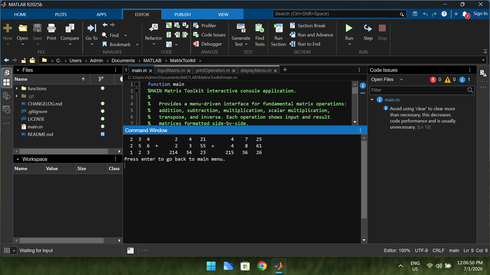
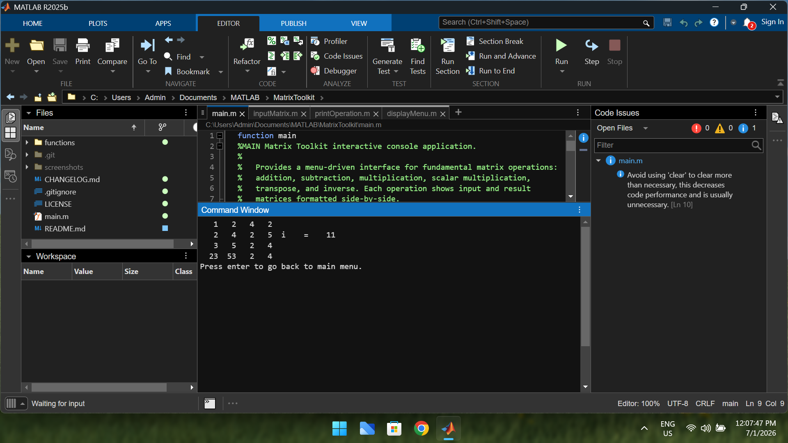

# MATLAB Matrix Toolkit

A beginner-friendly MATLAB console application for performing common matrix and linear algebra operations with robust input validation and professionally formatted console output.


## Contents

- [Features](#features)
- [Supported Operations](#supported-operations)
- [Preview](#preview)
- [Requirements](#requirements)
- [Installation](#installation)
- [Usage](#usage)
- [Project Structure](#project-structure)
- [Design Goals](#design-goals)
- [Contributing](#contributing)
- [License](#license)

## Features

- ➕ Matrix Addition
- ➖ Matrix Subtraction
- ✖ Matrix Multiplication
- 🔢 Scalar Multiplication
- 🔄 Matrix Transpose
- 🧮 Matrix Inverse
- 📐 Determinant
- 📊 Rank
- 📈 Trace
- ✅ Input Validation
- 🖥️ Interactive Console Menu
- 🎨 Formatted Side-by-Side Output


## Supported Operations

| Operation | Status |
|--|::|
| Matrix Addition | ✅ |
| Matrix Subtraction | ✅ |
| Matrix Multiplication | ✅ |
| Scalar Multiplication | ✅ |
| Matrix Transpose | ✅ |
| Matrix Inverse | ✅ |
| Determinant | ✅ |
| Rank | ✅ |
| Trace | ✅ |


## Preview

### Matrix Addition



### Trace of Matrix




## Requirements

- MATLAB R2020b or later

> **Note:** Octave compatibility is not officially guaranteed. Some formatting behavior may differ.


## Installation

Clone the repository:

```bash
git clone https://github.com/TechiError/matlab-matrix-toolkit.git
cd matlab-matrix-toolkit
```

Open the project in MATLAB and run:

```matlab
main
```


## Usage

1. Launch the application by running `main.m`.
2. Select the desired matrix operation from the menu.
3. Enter the matrix dimensions.
4. Input matrix values row by row.
5. View the formatted result directly in the MATLAB Command Window.


## Project Structure

```text
MATLAB-Matrix-Toolkit/
│
├── functions/
│   ├── displayMenu.m
│   ├── inputMatrix.m
│   ├── printOperation.m
│   └── validateChoice.m
│
├── screenshots/
│   ├── addition.png
│   └── trace.png
│
├── LICENSE
├── README.md
├── CHANGELOG.md
└── main.m
```


## Design Goals

- Clean and modular MATLAB code
- Beginner-friendly implementation
- Reusable utility functions
- Robust user input validation
- Professional console output formatting
- Easy to extend with additional matrix operations


## Contributing

Contributions, suggestions, and bug reports are welcome.

If you find a bug or have an idea for improvement, feel free to open an issue or submit a pull request.


## License

This project is licensed under the **MIT License**.

See the [LICENSE](LICENSE) file for details.


## Author

**TechiError**

GitHub: **[@TechiError](https://github.com/TechiError)**


## Why this project?

This project was developed to practice modular MATLAB programming while providing a simple toolkit for common matrix operations. It emphasizes clean code organization, reusable functions, input validation, and readable console output while leveraging MATLAB's built-in linear algebra capabilities instead of reimplementing standard algorithms.